<div align="center">

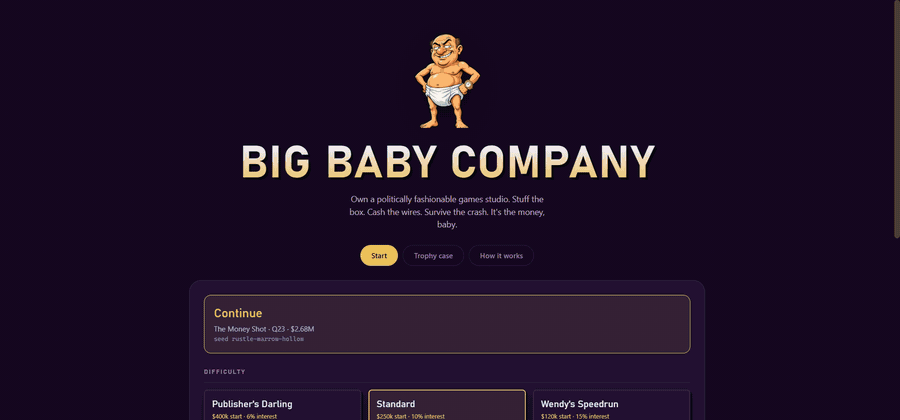

<sub>Act III. Hovering a card ghosts the result onto the HUD before you commit — the fashionable feature buys <b>+15 industry score</b> and costs you <b>1,085 sales</b>; the fun one buys +4 and <b>gains 4,816</b>. Same box, same tick, opposite directions. The run ends on a title that scored <b>100</b> and sold <b>nothing</b>.</sub>

# BIG BABY COMPANY

**A satirical studio-management roguelite about what happens when the number
you're being paid for stops being the number people are buying.**

`v1.0.8` · Browser · Single-player · ~60–90 minutes per run · Zero runtime dependencies

### [▶ Play it in your browser](https://nihilistau.github.io/big-baby-company/)

<sub>No install, no account, no launcher, no season pass. It saves to your own browser and we never see it.</sub>

</div>

---

## The pitch

You own a games studio.

There are two numbers on your dashboard. **Industry score** is what the press
writes about and what investors wire money against. **Copies** is how many
human beings bought the thing. In Act I these two numbers move in opposite
directions, and only one of them is paying your rent.

You will work out the trick within about ten minutes. Stuff the box with the
fashionable stuff, watch the score climb, watch the sales die, cash the wire
anyway. It works beautifully.

It works right up until the quarter it doesn't.

<div align="center">
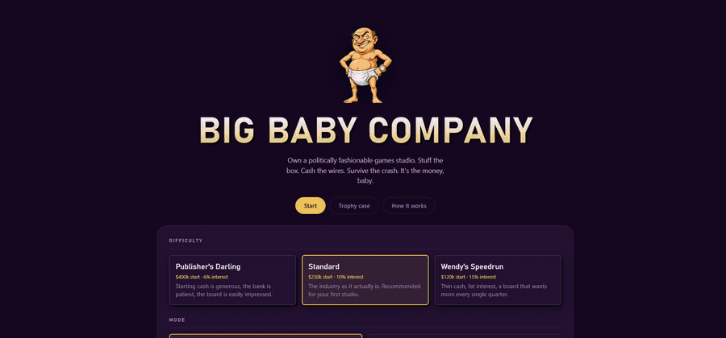
<br><em>Act I. Everything is going extremely well. One fashionable feature is
worth <b>+21 industry score</b> and <b>two thirds of your sales</b>. Ship it
anyway and the launch report explains why: customers paid you <b>$11k</b>, the
investor wired <b>$34k</b>.</em>
</div>

---

## Install and play

**The fastest way to play is to not install it at all:**
[nihilistau.github.io/big-baby-company](https://nihilistau.github.io/big-baby-company/).
Every push to `main` that passes the test suite redeploys it.

To run it locally you need **Node 18+**. Nothing else.

```bash
git clone https://github.com/nihilistau/big-baby-company.git
cd big-baby-company
npm install
npm run dev
```

Open the URL Vite prints — usually `http://localhost:5173`. That's it. No
account, no launcher, no telemetry, no storefront, no season pass. The irony
was not lost on us.

To build a static bundle you can drop on any host:

```bash
npm run build      # → dist/
npm run preview    # serve the built bundle locally
```

If the host serves it from a subdirectory rather than a domain root, set the
base path so the asset URLs resolve — this is what the Pages workflow does:

```bash
BASE_PATH=/big-baby-company/ npm run build
```

### Controls

| | |
|---|---|
| <kbd>1</kbd>–<kbd>7</kbd> | Jump to a room |
| <kbd>Space</kbd> *(hold)* | Show everything clickable in the scene |
| <kbd>E</kbd> | End the quarter |
| <kbd>B</kbd> | Open the books |
| <kbd>M</kbd> | Mute |
| <kbd>?</kbd> | Glossary |
| <kbd>Esc</kbd> | Close whatever is open |

Everything is also clickable. Nothing is on a timer. The quarter ends when you
say it ends, and the End Quarter button tells you what's blocking it.

---

## Objectives

**Survive twenty-four quarters.** Six years, eight titles, three acts.

There is no score to beat and no leaderboard to climb. There is a bank balance,
a rank, and an ending that is chosen by what your run actually looked like —
not by whether you won.

| Rank | Cash | |
|---|---|---|
| **Liquidated** | — | The chairs went at auction. |
| **Wendy's Is Hiring** | below $0 | They have a robust onboarding packet. |
| **Ramen Indie** | $0 | Still here. Barely. Still here. |
| **Broke Even, King** | $250k | Nobody writes articles about breaking even. |
| **Actually Sustainable** | $750k | Payroll is boring now. Boring is the achievement. |
| **King Baby** | $1.8M | The pool is real and the pool is paid for. |
| **Emperor Baby** | $3.5M | You are on someone else's slide now. |
| **The Big Baby Dynasty** | $6M | They named a conference stage after you. |

**Eleven endings.** Which one you get depends on cash, audience trust, industry
standing, whether you pivoted to live service, and whether you took the offer
when it came. The best ending in the game is not the richest one. The richest
one is still pretty good.

---

## The loop

Every title takes three quarters. Then you do it again, eight times.

<table>
<tr>
<td width="33%" valign="top">

### ① Pitch

Three concepts on the table. Pick one — its scope, its price, its audience.

Then decide **whose money builds it**: an investor who wants a score, a
publisher who wants a slot and 30%, or your own bank account, which wants
nothing and offers nothing.

</td>
<td width="33%" valign="top">

### ② Production

Spend dev points on feature cards. Hire people, or don't. Buy a desk.

**Crunch** to buy a point with everybody's weekend. **Polish** to spend a point
making what's already there actually work. Then live with the result.

</td>
<td width="33%" valign="top">

### ③ Launch

Choose a campaign and how much of your cash to set on fire with it.

Then ship, and watch the report: the score, the copies, which card combinations
fired, and whether your accumulated controversy picked today to come due.

</td>
</tr>
</table>

<div align="center">
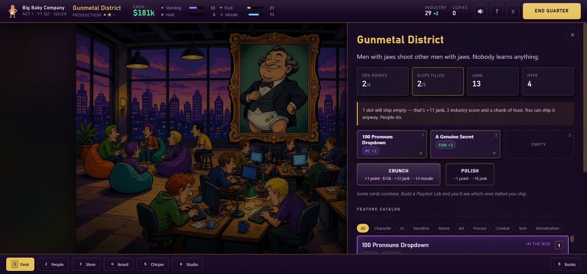
<br><em>The production board. Hover any card to see both numbers move before you commit.</em>
</div>

---

## The four meters

Four numbers, each one making a different decision hard.

| | What it buys you | How you lose it |
|---|---|---|
| ◆ **Standing** | Investor wires, better deal terms, award nominations | It decays every quarter in proportion to how much you have. The industry's memory is short and its rent scales with your reputation. |
| ♥ **Trust** | A multiplier on every copy you will ever sell | Slowly, by shipping fashionable nonsense. Quickly, by shipping something broken. |
| ▲ **Heat** | Reach — up to half again as many copies, on a curve that only really pays if you push it | It rolls against the backlash table at every launch, and the odds start climbing well before you feel notorious. High heat is the most profitable state in the game, right up until it isn't. |
| ☺ **Morale** | A cleaner build. Tired people ship broken games, and it lands as jank the moment the box closes | Crunch. Scope. Below 30 people quit mid-production, leak builds to the press, or quietly put back the thing you cut. |

Gains resist near the ceiling and losses never do, so no meter can be maxed once
and forgotten — and a dent takes real time to heal. Every source of reputation
goes through that curve, not just launches, which is the difference between a
meter you manage and a number that quietly finishes climbing in Act II and stops
mattering.

---

## Systems

<details>
<summary><strong>Cards, synergies and conflicts</strong> — 79 features, 24 synergies, 12 conflicts</summary>

<br>

Every feature card carries a stat block across four axes (**PC**, **FUN**,
**GORE**, **ORDINARY**), a dev-point cost, a jank value, a hype value, and tags.
Monetisation cards additionally earn per-player revenue independent of box
price, which is why a free-to-enter live-service title can out-earn a $70 one.

Cards combine. `Tight Gunfeel` next to `Headshots Count` fires **THE GUN
WORKS**. `Purple Mandate` next to `Arterial Spray` fires **GRAPE SODA
MASSACRE**, and your blood is now ultraviolet because the brand guide has no
exceptions.

Synergies are what stop the catalogue collapsing into "pick the highest
number". A card is worth what it is worth *next to the other cards*.

Four cards are locked behind cross-run achievements. `Lovable Jank` unlocks by
shipping something with 50+ jank. `Ask The Players For The Money` unlocks by
ending a quarter in debt. The catalogue grows as you fail.

</details>

<details>
<summary><strong>People</strong> — 16 hires, in two flavours that could not be less alike</summary>

<br>

**Injectors** raise your industry standing and put their pet feature into your
box whether you asked for it or not. Brie will inject a 100-pronoun dropdown
into a driving game. Tobias, the Chief Vision Officer, will remove combat in
the second week and costs you a permanent dev point for the privilege of
attending his meetings. They are the Act I trap, made of people.

**Talent** inject nothing. Rusty says nine words a week and every build he
touches gets faster. Sal has filed the bug eleven times. Gordo buys the pizza
with his own card and makes crunch half as expensive because he makes crunch
half as stupid. They are what you can afford once you stop optimising for the
board.

Morale is what decides which of them is still here in a year.

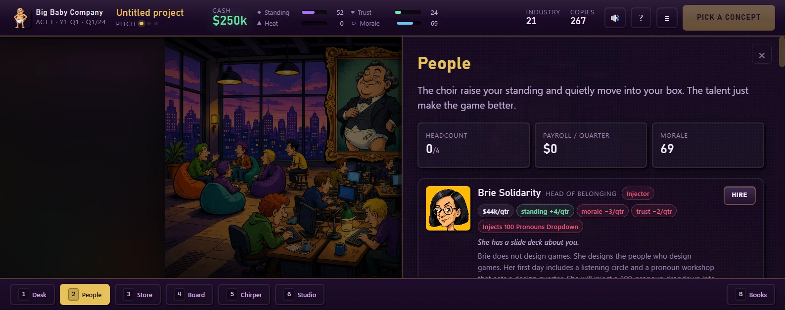

</details>

<details>
<summary><strong>Money</strong> — 8 funding deals, 20 studio upgrades, and a budget that bleeds</summary>

<br>

A title's budget is **drawn down across its three quarters**, not taken at
signing. A deal's advance pays that burn down first; anything left over is cash
in hand. Self-funding means you burn all of it yourself and keep all of the
upside.

Investor deals want an **industry score quota**, and that quota **goes up every
time you sign another one**. That is the entire trap, expressed as a number.

Cash is not the score. Cash is the thing you turn into capacity: extra desks
(+1 dev point, forever), a QA lab (jank nearly halved), a legal retainer
(absorbs one backlash outright), a community team (trust every quarter), a
publishing arm (you are the chequebook now). Every upgrade also adds to your
quarterly operating cost, because growth is never free.

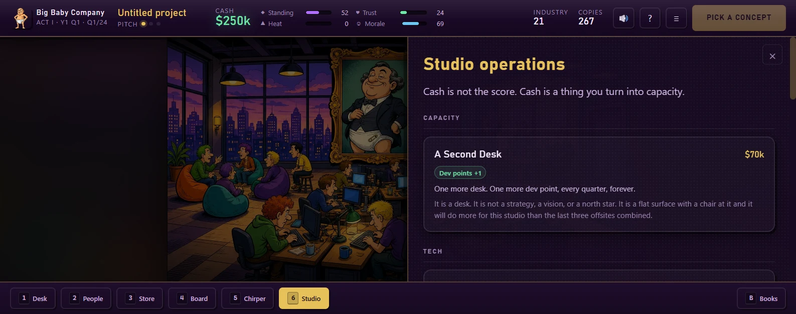

</details>

<details>
<summary><strong>Launch</strong> — 7 marketing channels, 8 backlash outcomes</summary>

<br>

Pick a channel and a spend. **Trailers** are reliable and unglamorous.
**Awards Push** buys standing and score and explicitly not sales. **Just Show
The Game** buys enormous trust and reaches fewer people. **Seed The Discourse**
buys the biggest wishlist graph on the list and has a one-in-three chance of an
agency invoice leaking with two hundred account handles on it.

Then Heat rolls. Refund waves, quiet delistings, open letters signed by forty
industry figures of whom nine took your money. Or — occasionally — it backfires
upward and puts you on the front page of four sites at once, and nobody
involved intended that either.

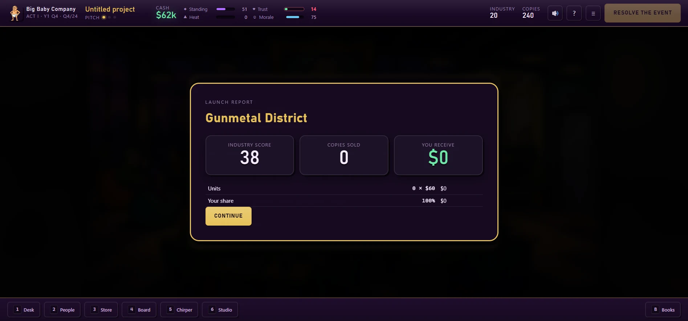

</details>

<details>
<summary><strong>Chirper</strong> — a live feed of people being wrong about you</strong></summary>

<br>

169 authored posts across 14 recurring accounts with their own arcs. The
journalist who turns on you. The hater who grudgingly comes around. The leaker
who is always right and always early. Sheila, 71, who has never pre-ordered
anything in her life.

The feed runs live while it's open: engagement counters climb, ambient chatter
drifts in filtered by your current state, and new posts drop in from the top.
Reach scales by **who** is posting rather than what they said, which is both
the joke and, unfortunately, roughly accurate.

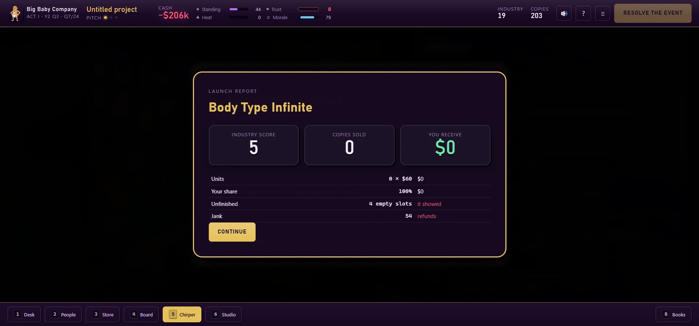

</details>

<details>
<summary><strong>Roguelite structure</strong> — seeds, a conditional deck, and cross-run unlocks</summary>

<br>

72 events, drawn by weight from a deck filtered by act, phase, and state
predicates — high-heat events only appear when you're actually in trouble,
morale events only when the building is unhappy. 191 choices, 13 of them
resolving on a dice roll.

Three scripted beats always land in the same place so the story reads: the
values pass, the crash, the offer.

Every run is a shareable **word-triple seed**. Same seed, same difficulty, same
events, same dice. Achievements, card unlocks, and endings seen persist across
runs in a Trophy Case.

</details>

---

## The three acts

<table>
<tr><td width="50%" valign="top">

### Act I — The Purple Years

Titles 1–3. There is investor money, the industry loves you, and the sales
figures are somebody else's problem. Unlock the penthouse. Dunk on the haters
from beside a pool your customers did not pay for.

It ends with a flagship whose wire is calculated, displayed, and never sent.

</td><td width="50%" valign="top">

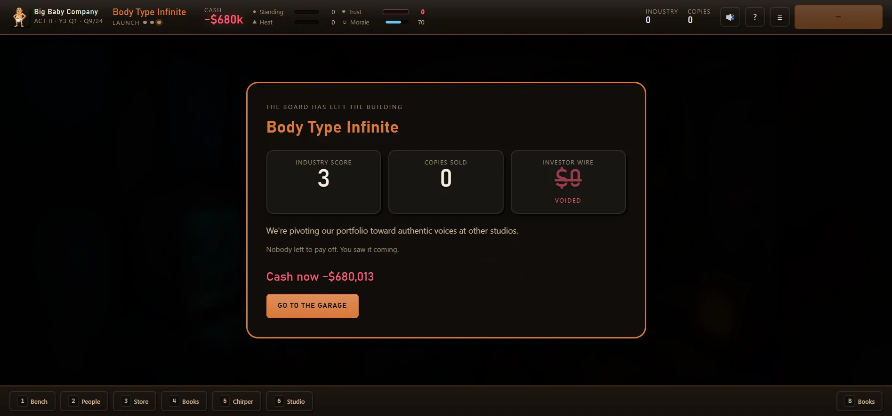

</td></tr>
<tr><td width="50%" valign="top">

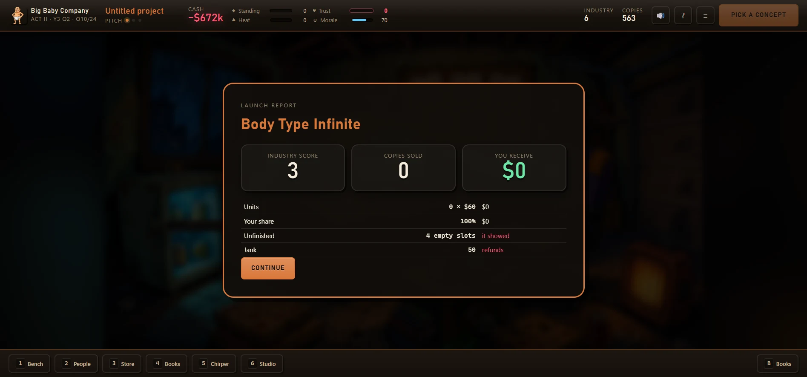

</td><td width="50%" valign="top">

### Act II — The Garage

Titles 4–6. One desk, one CRT, a mini-fridge containing a ketchup packet and a
threat. No board to impress and no wire coming. Copies are the only number left
and every point of audience trust you burned in Act I is a debt you are now
paying.

This is where most people find out what they actually wanted to make.

</td></tr>
<tr><td width="50%" valign="top">

### Act III — The Empire

Titles 7–8. You're big again, and now *you're* the one holding the chequebook.
Somebody offers to buy the studio, the catalogue, the mascot and the team, and
the number is real.

Take it and the run ends here, richer than you will ever be otherwise. Refuse
and you keep the building and one more title to prove a point.

</td><td width="50%" valign="top">

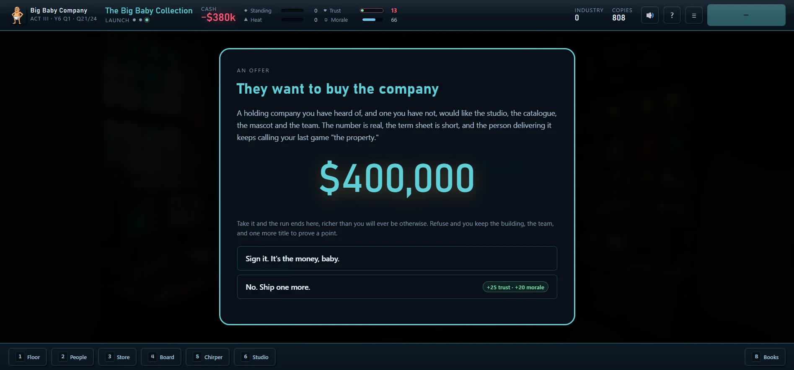

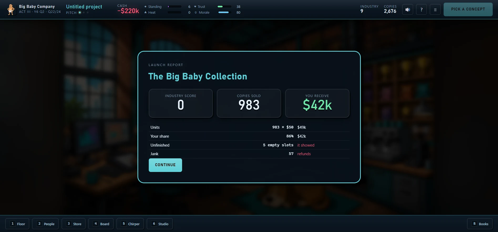

</td></tr>
</table>

---

## Difficulty and modes

| Difficulty | Start | Interest | |
|---|---|---|---|
| **Publisher's Darling** | $400k | 6% | The board is easily impressed. |
| **Standard** | $250k | 10% | The industry as it actually is. |
| **Wendy's Speedrun** | $120k | 15% | A board that wants more every single quarter. |

**Campaign** is the 24-quarter run. **Endless** unlocks when you finish one:
procedurally generated titles, escalating quotas, rising interest, no ending.
It stops when you do.

There is a soft fail. Take on enough debt and you file **Chapter 11** — once.
It discharges what you owe and takes every upgrade, the whole team, a permanent
dev point, and hands creditors a permanent slice of your revenue forever. The
second filing is the end.

---

## Documentation

| | |
|---|---|
| [**Gameplay Manual**](docs/gameplay.md) | How to play, in detail. Phases, meters, strategies, and what the numbers actually do. |
| [**Systems Reference**](docs/systems.md) | The mechanics, with formulas. Every table, every multiplier, every threshold. |
| [**Design Notes**](docs/design.md) | Why it's shaped like this. The decisions, the failures, and what the balance harness caught. |
| [**Content Bible**](docs/content.md) | The catalogue. Cards, staff, events, endings, and the rules for adding more. |
| [**Architecture**](docs/architecture.md) | Technical. Module layout, determinism, the renderer, the test strategy. |
| [**Art Pipeline**](docs/art-pipeline.md) | How the art gets made, and how to regenerate it. |
| [**Changelog**](CHANGELOG.md) | What changed and when. |

---

## Built with

Vanilla ES modules. Vite. **Zero runtime dependencies.**

```
10,529 lines of JavaScript · 164 tests · 54 art assets · 4,804 lines of content JSON
```

The simulation is pure and synchronous — `advance(state, content)` takes a
state and returns `{ state, events }`. Every animation lives in the UI layer,
which is why everything is skippable, everything is testable, and the balance
harness can play a few thousand campaigns in a few seconds.

Art is bold-ink MAD-magazine caricature over VGA adventure-game backgrounds,
generated through a manifest-driven pipeline and committed to the repo. Audio
is synthesised at runtime — there is not a single audio file in this project.

### Verify it yourself

```bash
npm test                            # 164 tests: sim, content integrity, fuzz, UI
node tools/balance-sim.mjs          # Monte-Carlo balance sweep across six archetypes
node tools/ch11-probe.mjs           # where a careful player actually goes broke
npm run probe                       # meter attribution and the frugal-player curve
node tools/gen-art.mjs --check      # every asset present, correct, consistent
npm run verify                      # all of the above
```

The balance harness **fails** if any strategy becomes unwinnable or dominant,
if fewer than five ranks are reachable, or if one rank absorbs more than half
of all runs. The numbers in `src/sim/balance.js` are tuned against it, not
eyeballed.

---

## License

[MIT](LICENSE). Clone it, read it, fork it, take the renderer, take the balance
harness, ship your own thing with it.

One honest caveat that MIT does not speak to: the art in `public/assets/` was
generated through the xAI Imagine API rather than drawn by hand. The licence
here covers this repository's contents as far as we can grant it — if you plan
to reuse those images commercially, check the generating provider's terms as
well. The code, the content JSON and the writing are unambiguous.

---

## A note on the joke

This is satire, and it points in every direction it can reach: at consultants
and at executives, at review-score cartels and at battle passes, at people who
have never shipped anything and at people who have shipped nine things and
learned nothing, at crunch, at layoffs announced by calendar invite, and at an
audience that will pre-order anything with a number after it.

The player is the villain. That's the design. You are the person making these
decisions, and the game is extremely interested in which ones you make when
nobody is watching and the wire has cleared.

There are no real people in it, and the cartoon adult in the nappy is nobody in
particular. He just wants the money.

---

<div align="center">

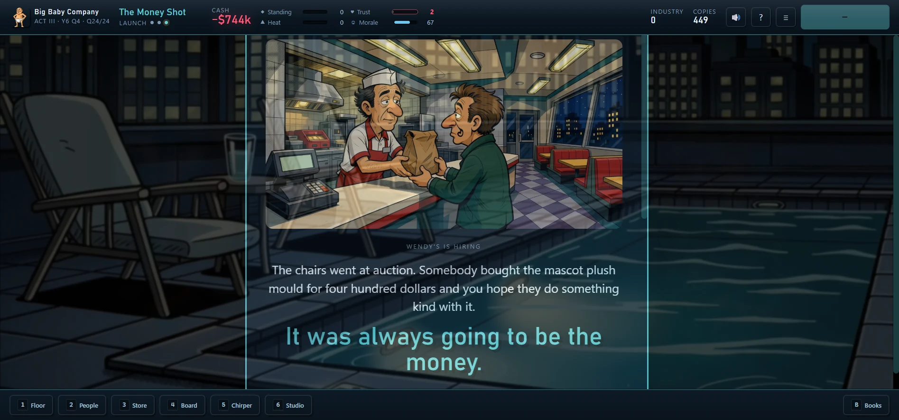

**It's the money, baby.**

</div>
