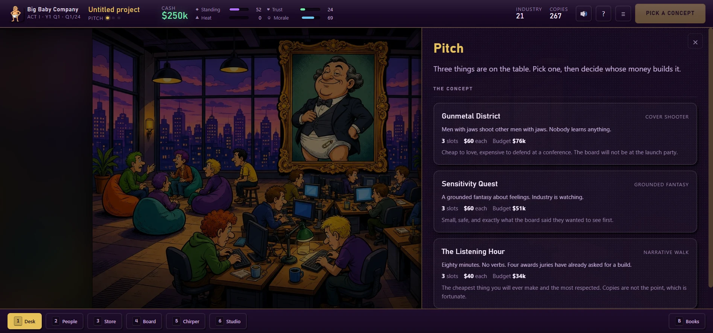

# Gameplay Manual

Everything a player needs, in the order they need it. For the maths behind any
of this see the [Systems Reference](systems.md); for why it's shaped this way
see the [Design Notes](design.md).

---

## 1. What you are doing

You run a games studio for six years. That's **24 quarters**, **8 titles**,
**three acts**.

Every title takes three quarters: **pitch** it, **build** it, **launch** it.
Then the next one. Nothing is on a timer — the quarter ends when you press End
Quarter, and the button tells you what's stopping it if it's disabled.

At the end you get a bank balance, a rank, and one of eleven endings. There is
no failure state that isn't interesting.

---

## 2. The thing you need to understand first

There are two numbers in the top-right of the HUD.

**INDUSTRY** is your projected industry score. It's what the press reacts to
and what investors pay against.

**COPIES** is your projected sales. It's what customers pay.

**These two numbers fight each other.** Features that push one up push the
other down:

| Axis | Industry score | Copies |
|---|---|---|
| **PC** | ▲▲ up hard | ▼▼ down hard |
| **FUN** | ▼ down | ▲▲ up hard |
| **GORE** | ▼▼ down hard | ▲ up, plus heat |
| **ORDINARY** | ~ barely moves | ▲ up, quietly |

**Hover any card in the catalogue** and both numbers ghost their change before
you commit. This is the single most useful thing in the interface. Use it
constantly.

In **Act I** there is investor money, so industry score is the number that pays
you and copies barely matter. This is true, it works, and it is a trap. The
crash removes investor money permanently, and after that copies are the only
number left — while every point of audience trust you burned in Act I is still
gone.

---

## 3. The three phases

### ① Pitch

**Choose a concept.** Three are offered. They differ in **slots** (how big the
box is), **price**, **budget**, and audience skew. Bigger isn't automatically
better — a six-slot box you can only half-fill ships with visible holes.

**Choose your funding.** This is the real decision.

| Type | You get | They want |
|---|---|---|
| **Self-fund** | Everything | Nothing. You burn the whole budget yourself. |
| **Investor** | Production funded, plus a launch wire scaled to your score | An **industry score quota**, and a slice of unit revenue |
| **Publisher** | Production funded, plus a real marketing budget | 15–45% of revenue, and sometimes a **mandated feature slot** |
| **Crowdfund** | An advance scaled to your audience trust | Some of that trust, spent |

> **The escalating quota is the trap.** Every investor deal you sign raises the
> score bar on the *next* one. Sign three and you'll be chasing a number that
> requires a box nobody will buy.

**Budget burns over three quarters**, not at signing. A deal's advance pays
that burn down first; anything left over is cash in hand immediately. This
means you need working capital even when someone else is funding you.

### ② Production

**Dev points** are what you can afford to build this quarter. Cards cost 1–3.
You get more from acts, extra desks, producers, and crunch.

**Slots** are how big the box is. Empty slots ship as an unfinished game — jank,
lost score, lost copies, lost trust. This is legal. People do it.

| Action | Cost | Effect |
|---|---|---|
| **Place a card** | its dev-point cost | Fills a slot, adds its stats |
| **Crunch** | money + 12 jank + 13 morale | +1 dev point. Each crunch in the same title costs more. |
| **Polish** | 1 dev point | −18 jank |
| **Hire** | salary every quarter, forever | See below |
| **Buy an upgrade** | cash + permanent operating cost | See Studio Ops |

**Watch the synergy list.** Cards combine, and combinations are where the real
numbers live. Build a Playtest Lab and you'll see which ones your box will fire
*before* you ship.

### ③ Launch

**Pick a campaign and a spend.**

| Channel | Good for | Watch out |
|---|---|---|
| **Word of Mouth** | Free. Small trust bump. | Reaches who it reaches. |
| **Trailer Campaign** | Reliable, no surprises | No upside surprise either |
| **Influencer Package** | Biggest reach per dollar | 22% chance somebody forgets the #ad tag |
| **Awards Push** | Standing and score | Explicitly *not* sales |
| **Seed The Discourse** | The biggest wishlist graph available | 35% chance the agency invoice leaks |
| **Just Show The Game** | Enormous trust | Fewer people see it |
| **Festival Circuit** | Slow, cheap, standing and trust | Takes time to pay off |

Then ship. The report shows the score, the copies, every synergy and conflict
that fired, and whether Heat picked today to come due.

---

## 4. The four meters

| | Range | What it does |
|---|---|---|
| ◆ **Standing** | 0–100 | Sizes investor wires, gates better deals, earns nominations. **Decays 3/quarter.** |
| ♥ **Trust** | 0–100 | Multiplies every copy you sell, ×0.6 to ×1.4. |
| ▲ **Heat** | 0–100 | Multiplies copies up to ×1.33 — and rolls the backlash table at launch. |
| ☺ **Morale** | 0–100 | Below 30, people quit, leak and sabotage. |

After every quarter, a small delta appears beside each meter showing what the
quarter did to it. Watch those — they're how you learn what drives what.

**Standing** goes up with PC content, awards pushes, PR firms, and — grudgingly
— commercial success. It goes down every quarter regardless.

**Trust** goes up with FUN, GORE, ORDINARY, polish, honesty, and community
teams. It goes down with PC content, jank, broken promises and monetisation.

**Heat** goes up with gore, monetisation, crunch, jank, dunks and provocative
marketing. It cools 5/quarter. Above 30 it starts rolling against the backlash
table at every launch.

**Morale** goes up with raises, perks, time off, good chairs, profit share and
winning. It goes down with crunch and with scope beyond four slots.

---

## 5. People

Two kinds of hire, and telling them apart is most of the game's HR system.

**Injectors** — Brie, Xander, Karen, Ash, Morgan, Jules, Tobias, Petra, Viktor.

They raise your industry standing every quarter and, when the box locks, they
put their pet feature into it. If their pet is already there they'll reach for
a backup. If the box is full they'll **overwrite a FUN card**. If there's
nothing left to take they add ambient PC anyway.

They are exactly as useful as your industry score is valuable, which is to say:
very, in Act I, and never again.

**Talent** — Rusty, Mei, Dutch, Sal, Lin, Gordo, Wren.

They inject nothing. They add dev points, cut jank at lock, add FUN or GORE
auras, generate hype and trust every quarter, or make crunch cheaper.

> **Every head is also PC pressure in Act I.** Headcount itself pushes your PC
> axis up and your copies down. A big Act I studio is a big Act I problem.

---

## 6. Money

**Cash is not your score.** Cash is the thing you turn into capacity.

**Studio upgrades** are permanent and carry across titles. A second desk is +1
dev point forever. A QA lab nearly halves jank at launch. A legal retainer
absorbs one backlash outright. A community team generates trust every quarter.
Buying back your IP matters enormously the day somebody offers to buy the
company.

Every upgrade also adds to your **quarterly operating cost**. Growth is never
free.

**Debt** accrues interest every quarter at your difficulty's rate. Let it get
deep enough and you file **Chapter 11**: the debt is discharged, and you lose
every upgrade, the whole team, a permanent dev point, a permanent staff slot,
and hand creditors a permanent 14% of all future revenue. You survive this
once. The second filing ends the run.

---

## 7. The acts

### Act I — The Purple Years (titles 1–3)

Investor money is available and industry score is what it pays for. Hire the
choir, stuff the box, cash the wire. Cross $100k in lifetime wires and the
elevator to the penthouse starts working.

**It ends with a flagship whose wire is calculated, shown to you, and never
sent.** How badly that hurts depends on your severance bill, your audience
trust, and whether you bought a legal retainer.

### Act II — The Garage (titles 4–6)

No board, no wire, one desk. Copies are the only number. Your Act I trust debt
comes due immediately.

Operating costs are far lower here, which is the one mercy. Budgets are small.
This is where you find out whether you can actually make something people want.

### Act III — The Empire (titles 7–8)

You're big again. Bigger budgets, bigger operating costs, monetisation cards
unlock, and live-service becomes available.

**After title seven, somebody offers to buy the studio.** Taking it ends the
run immediately with a large pile of cash and a specific ending. Refusing costs
you standing, gains you enormous trust and morale, and gives you one more title.

---

## 8. Strategy notes

**The optimal line is the one the game is about.** Take investor money in Act
I, bank it, and pivot the moment the board leaves. Balance-sim confirms it:
the bot that does this is the strongest in the game, and the bot that never
pivots is the weakest.

**Trust compounds.** It multiplies every copy of every future title. Spending
it for a short-term gain in Act I is a loan at a terrible rate.

**Heat is a real strategy, not a penalty.** High-heat runs are the highest
ceiling in the game. A legal retainer turns one catastrophe into a paragraph.

**Crunch has a floor and a ceiling.** One crunch to finish a box is usually
correct. Three is how you lose your team in Act II.

**Don't over-scope.** Slots beyond your dev points add jank *and* morale
damage. A finished four-slot box beats a broken six-slot one every time.

**Buy desks early.** +1 dev point compounds across every remaining title in the
run. It is almost always the best thing you can do with your first spare
$70,000.

---

## 9. Seeds, unlocks and Endless

Every run has a **word-triple seed** (`purple-diaper-wire`). Same seed and
difficulty gives the same events, the same draws, the same dice. Type one in on
the title screen to replay a run, or share one.

**The Trophy Case** tracks 47 achievements, every ending you've seen, your best
cash, and which cards you've unlocked. Four cards unlock through play:

| Card | Unlock |
|---|---|
| `Ragdolls With Opinions` | Ship a title with 4+ GORE |
| `Mod Tools On Day One` | Ship 3 titles across all runs |
| `Lovable Jank` | Ship a title with 50+ jank |
| `Ask The Players For The Money` | End a quarter in debt |

**Endless mode** unlocks when you finish a campaign. Procedurally generated
titles with escalating quotas and rising interest, running until you fold.
